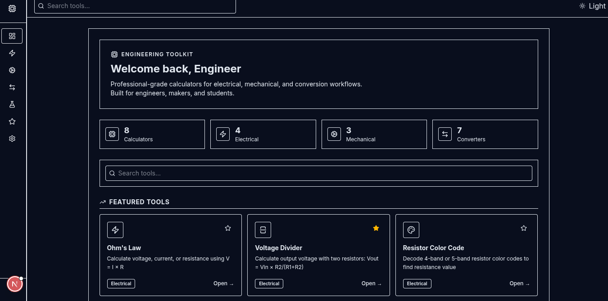

# Engineering Toolkit

A professional-grade, open-source engineering calculator suite built for electrical, mechanical, and general engineering workflows. 
The application provides a clean, classic desktop software aesthetic, focusing on speed, accuracy, and ease of use.

 *(Note: add screenshot here)*

## Features

- **Electrical Calculators:**
  - Ohm's Law (V = I × R)
  - Voltage Divider
  - Resistor Color Code (4/5 Band)
  - Power Calculator
  - *More coming soon...*
- **Mechanical Calculators:**
  - Gear Ratio
  - Torque Calculator
  - Beam Bending Calculator
- **Conversions & Materials:**
  - Comprehensive Unit Converter (Length, Mass, Temp, Pressure, Area, Volume, Angle)
  - Material Properties Reference
- **Core Functionalities:**
  - Clean, distraction-free "classic software" UI
  - Favorites & Recently Used tools
  - Dark/Light mode support
  - 100% Client-side computation for instant results and privacy

## Tech Stack

- **Framework:** Next.js 16 (App Router, Client-side)
- **Language:** TypeScript
- **Styling:** Tailwind CSS (v4) with custom classic UI tokens
- **Icons:** Lucide React
- **State Management:** React Context API + LocalStorage

## Getting Started

First, run the development server:

```bash
npm install
npm run dev
# or
yarn dev
# or
pnpm dev
# or
bun dev
```

Open [http://localhost:3000](http://localhost:3000) with your browser to see the result.

## Project Structure

- `/src/calculators` - Contains the individual engineering calculator components.
- `/src/components` - Shared UI components (Input, ResultBox, Sidebar, etc.).
- `/src/views` - Main sections of the application (Dashboard, Electrical, Mechanical).
- `/src/context` - Global application state management.
- `/src/data` - Data registries for calculators and materials.
- `/src/types` - TypeScript interfaces.

## Contributing

Contributions are welcome! If you have a specific engineering calculator you'd like to see, please follow the current structure:
1. Create your component in `/src/calculators`.
2. Register your calculator in `/src/data/calculators.ts`.
3. Add it to the relevant category view (e.g., `/src/views/ElectricalPage.tsx`).

## License

This project is open-source and available under the MIT License.
